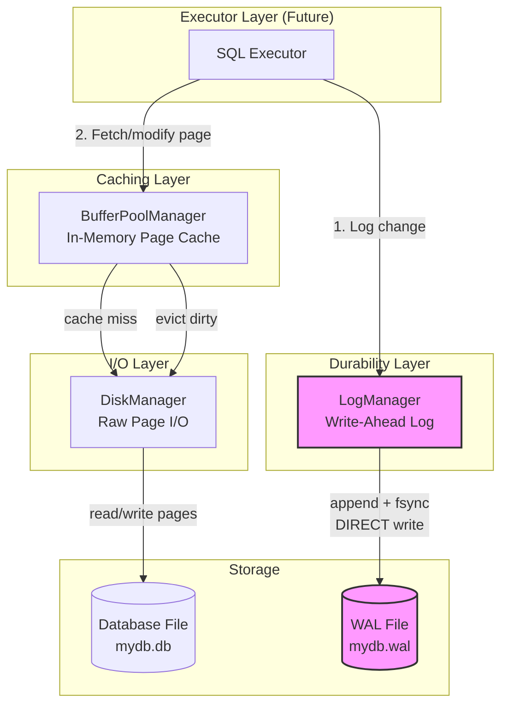
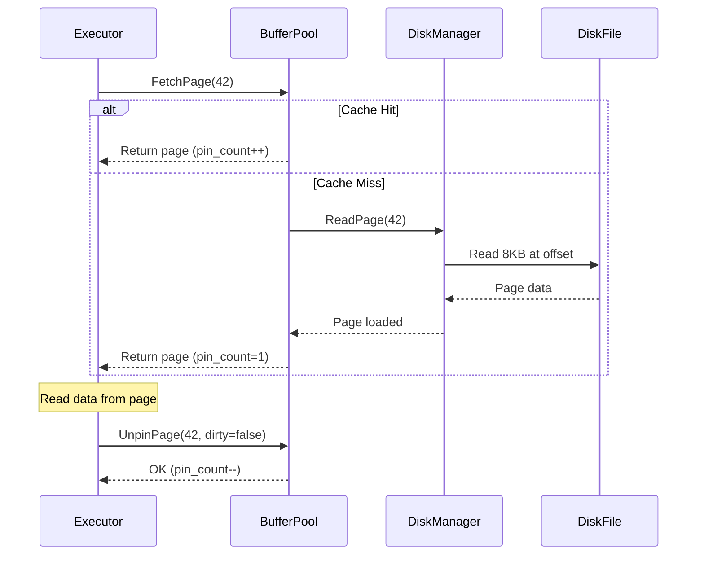
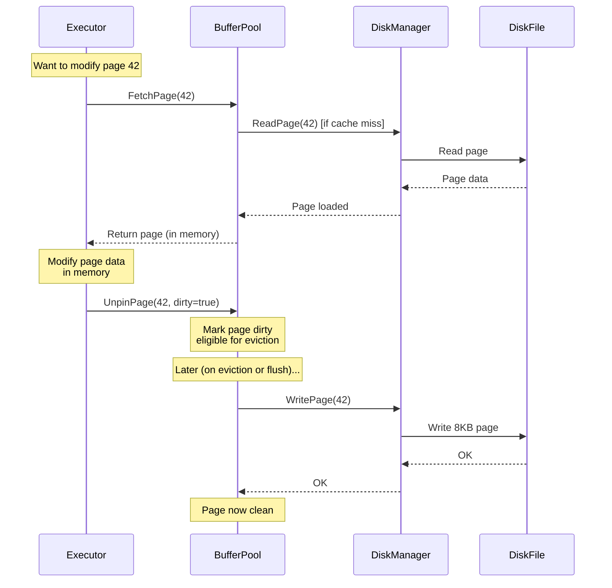
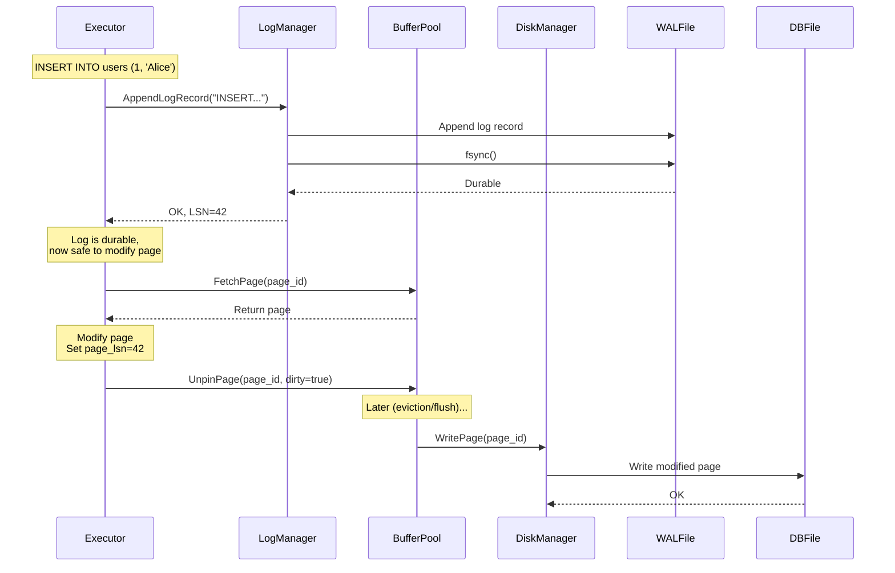
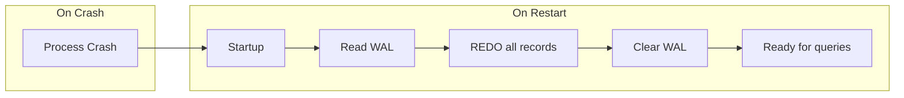

# Storage Layer Architecture

**Status**: Phase 1 Complete (Buffer Pool + Basic WAL)  
**Last Updated**: 2026-05-13

## Overview

The storage layer manages all persistent data in pesdb. It provides a multi-tier architecture from raw disk I/O up through write-ahead logging for crash recovery.

## Architectural Layers



**CRITICAL: Two Separate I/O Paths**

1. **Page I/O** (mydb.db): BufferPoolManager → DiskManager → Disk
   - All page reads and writes go through these layers
   - Cached, buffered, LRU-managed
   
2. **Log I/O** (mydb.wal): LogManager → Disk (DIRECT)
   - WAL bypasses BufferPoolManager and DiskManager completely
   - Append-only, no caching, direct write via std::fstream
   - Separate file, separate I/O path

### Layer Responsibilities

| Layer | Component | Responsibility | I/O Path | Status |
|-------|-----------|----------------|----------|--------|
| **I/O** | DiskManager | Raw page read/write, page allocation | mydb.db | ✅ Done |
| **Caching** | BufferPoolManager | LRU page cache, pin/unpin, dirty tracking | Uses DiskManager | ✅ Done |
| **Durability** | LogManager | Append-only WAL, log records | mydb.wal (DIRECT) | ✅ Phase 1 Done |
| **Executor** | SQL Executor | Query execution, uses WAL + BPM | Uses both paths | ❌ Not Started |

### Why Two Separate I/O Paths?

**Page I/O needs caching:**
- Pages are read repeatedly (queries scan same data)
- Random access (page 5, then 100, then 3)
- Benefits from LRU caching
- Writes can be deferred (write-back cache)
- Goes through: BufferPoolManager → DiskManager → mydb.db

**Log I/O needs simplicity:**
- Append-only (sequential writes to end of file)
- Written once, read once (during recovery)
- Must be durable immediately (no buffering)
- No benefit from caching
- Goes direct: LogManager → mydb.wal

Trying to force WAL through BufferPoolManager would be wrong:
- WAL needs append-only semantics (BPM is random access)
- WAL needs immediate durability (BPM defers writes)
- WAL is sequential (BPM optimizes for random access)
- They solve different problems, use different files

## Read Flow

How data reads flow through the layers:



**Key Points:**
- Reads and writes use the **same fetch path**
- BufferPool caches pages to avoid disk I/O
- Pages are pinned while in use (prevents eviction)
- Cache miss triggers synchronous disk read

## Write Flow (Without WAL)

Current write flow (Phase 1 - WAL exists but not integrated):



**Key Points:**
- Writes modify pages **in-memory** first
- Dirty flag marks pages that need to be written back
- Actual disk write happens **asynchronously** (on eviction or explicit flush)
- This is a **write-back cache** (not write-through)

## Write Flow (With WAL - Future Phase 2)

How writes will work once WAL is integrated with the executor:



**The Write-Ahead Protocol:**
1. **Log first**: Write log record, fsync to disk
2. **Then modify**: Change the in-memory page
3. **Write later**: Page reaches disk asynchronously

**Why this order matters:**
- If crash after step 1: Log is durable, can replay on recovery
- If crash after step 2: Log is durable, page change can be recovered
- If crash during step 3: Log exists, can redo the change

## Component Details

### DiskManager

**Purpose**: Raw page I/O and page allocation  
**Thread Safety**: Not thread-safe (BufferPoolManager serializes access)  
**Key Operations**:
- `AllocatePage()` -> Assigns next page_id
- `ReadPage(page_id, data)` -> Reads 8KB page from disk
- `WritePage(page_id, data)` -> Writes 8KB page to disk

**File Format**:
```
[Page 0: 8KB][Page 1: 8KB][Page 2: 8KB]...
```

**Design Doc**: `doc/design/storage/disk-manager.md`

### BufferPoolManager

**Purpose**: In-memory page cache with LRU eviction  
**Thread Safety**: Thread-safe (mutex-protected)  
**Key Operations**:
- `FetchPage(page_id)` -> Get page into memory (pin it)
- `NewPage(page_id*)` -> Allocate and pin new page
- `UnpinPage(page_id, dirty)` -> Release page, mark dirty if modified
- `FlushPage(page_id)` -> Force write to disk
- `FlushAllPages()` -> Write all dirty pages

**LRU Eviction**:
- Maintains LRU list of unpinned pages
- On cache miss, evicts least recently used unpinned page
- Pinned pages (pin_count > 0) cannot be evicted
- Dirty pages are written to disk before eviction

**Design Doc**: `doc/design/storage/buffer_pool_manager.md`

### LogManager (Phase 1)

**Purpose**: Append-only write-ahead log  
**Thread Safety**: Thread-safe (mutex-protected)  
**Key Operations**:
- `AppendLogRecord(record)` -> Write log entry, flush to OS
- `ReadAllLogRecords()` -> Read all log entries (for recovery)
- `ClearLog()` -> Truncate log (after recovery)

**Log Record Format** (Phase 1):
```
[uint32 total_size][uint8 type][string table_name][vector<int64> tuple]
```

**Current Limitations** (Phase 1):
- No LSNs (log sequence numbers)
- No transaction IDs
- No page-LSN tracking
- flush() to OS, not fsync() to disk
- Not integrated with executor/buffer pool

**Design Doc**: `doc/design/wal/log_manager.md`

## Data Flow Examples

### Example 1: First-Time Read (Cold Cache)

```
User queries row from page 42:
1. BufferPool.FetchPage(42) -> cache miss
2. DiskManager.ReadPage(42) -> reads from disk
3. Page loaded into frame, pin_count=1
4. Executor reads row data
5. BufferPool.UnpinPage(42, dirty=false) -> pin_count=0, eligible for eviction
```

### Example 2: Cache Hit

```
User queries row from page 42 (already cached):
1. BufferPool.FetchPage(42) -> cache hit! pin_count++
2. Executor reads row data
3. BufferPool.UnpinPage(42, dirty=false) -> pin_count--
(No disk I/O needed)
```

### Example 3: Write with Eviction

```
User inserts row into page 42 (small buffer pool, page 10 gets evicted):
1. BufferPool.FetchPage(42) -> cache miss
2. Need free frame, but all frames used
3. Pick LRU unpinned page (page 10, dirty=true)
4. DiskManager.WritePage(10) -> write dirty page to disk
5. Reuse frame: DiskManager.ReadPage(42) -> load page 42
6. Executor modifies page 42
7. BufferPool.UnpinPage(42, dirty=true)
```

### Example 4: Write with WAL (Future)

```
User inserts row:
1. LogManager.AppendLogRecord("INSERT INTO users (1, 'Alice')")
2. fsync WAL to disk (durable)
3. BufferPool.FetchPage(42)
4. Modify page in memory
5. BufferPool.UnpinPage(42, dirty=true)
6. Later: dirty page flushed to disk

If crash between step 5-6:
- Log has the insert (durable)
- Recovery replays log, re-inserts the row
```

## Recovery Architecture (Phase 2 - Not Yet Implemented)



**Recovery Process** (planned for Phase 2):
1. Open WAL file
2. Read all log records
3. For each record: replay the operation (idempotent)
4. Clear the log
5. Begin normal operation

**Why it works**:
- Log is durable before page changes are visible
- Recovery replays all logged operations
- Pages that didn't make it to disk are reconstructed
- Idempotency ensures replaying twice is safe

## Phase Roadmap

### Phase 1: Storage Foundation ✅ COMPLETE
- [x] DiskManager - raw page I/O
- [x] BufferPoolManager - caching layer with LRU eviction
- [x] LogManager - basic WAL (append/read/clear)
- [x] All tests passing

**What's Missing in Phase 1**:
- WAL not integrated with executor (no executor exists yet)
- No LSNs or page-LSN tracking
- No actual recovery process

### Phase 2: Recovery & Durability (NEXT)
- [ ] Add LSNs to log records
- [ ] Track page_lsn on each page
- [ ] Build recovery manager
- [ ] Implement REDO recovery
- [ ] Add transaction records (BEGIN/COMMIT/ABORT)
- [ ] Integrate WAL with executor

### Phase 3: Production Durability
- [ ] Real fsync (not just flush)
- [ ] Checkpoints
- [ ] Log truncation
- [ ] Group commit optimization

## Key Invariants

These properties must ALWAYS hold:

1. **Pin Contract**: Pinned pages (pin_count > 0) cannot be evicted
2. **Dirty-Before-Evict**: Dirty pages must be written to disk before eviction
3. **Write-Ahead (future)**: Log record durable before corresponding page write
4. **Page Size**: All pages are exactly PAGE_SIZE (8KB) bytes
5. **Sequential Page IDs**: Pages numbered 0, 1, 2, ... (DiskManager assigns)

## Testing Strategy

### Unit Tests (Current)
- **DiskManager**: Page allocation, read/write, file persistence
- **BufferPoolManager**: Fetch, pin/unpin, LRU eviction, dirty pages, cache hits
- **LogManager**: Append, read-all, torn tail handling, clear

### Integration Tests (Future - Phase 2)
- Crash recovery scenarios
- WAL + BufferPool coordination
- Multi-threaded concurrent access
- Large workloads (cache pressure)

## References

**Design Documents**:
- `doc/design/storage/page.md` - Page structure
- `doc/design/storage/disk-manager.md` - Disk I/O layer
- `doc/design/storage/buffer_pool_manager.md` - Caching layer
- `doc/design/wal/log_manager.md` - Write-ahead log

**Real-World Implementations**:
- PostgreSQL: `src/backend/storage/buffer/` - Buffer pool
- PostgreSQL: `src/backend/access/transam/xlog.c` - WAL
- SQLite: `src/pager.c` - Page cache
- SQLite: `src/wal.c` - WAL implementation

**Academic Papers**:
- ARIES: A Transaction Recovery Method (Mohan et al., 1992)
- The Design and Implementation of Modern Column-Oriented Database Systems (Abadi et al., 2013)
