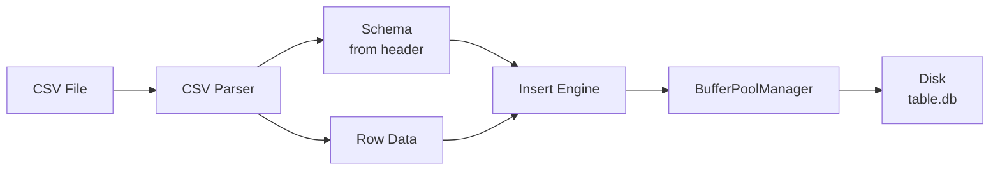
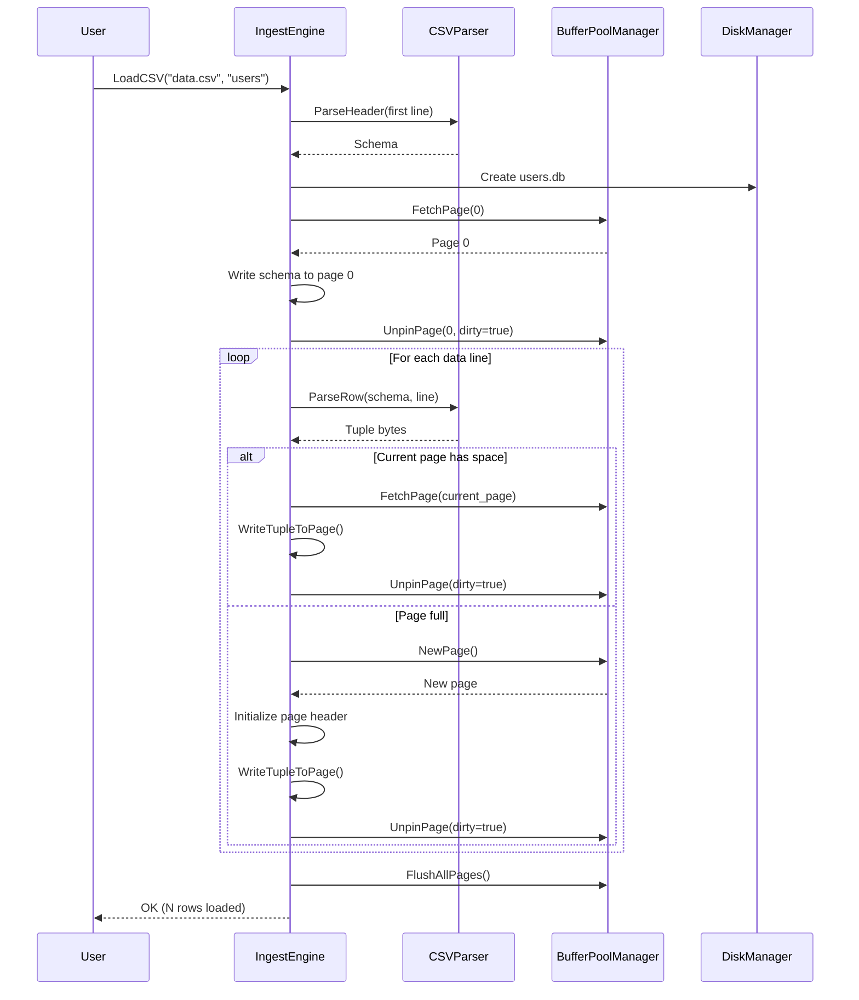

# CSV Ingest Pipeline Design

**Status**: Design Phase  
**Goal**: Load CSV data into row-oriented heap storage  
**Last Updated**: 2026-05-14

## Overview

Build a pipeline to ingest CSV files into pesdb's storage layer. This is the foundation for everything else - once we can load data, we can query it, index it, and convert it to columnar format.



## Design Goals

1. **Flexible schema** - support variable columns and types
2. **Self-contained tables** - each table is one .db file
3. **Simple row format** - tuple-at-a-time storage (optimize to columnar later)
4. **Leverage existing storage** - use BufferPoolManager we already built
5. **Type-safe** - explicit type declarations in CSV header

## File Organization

**One file per table** (like PostgreSQL, MySQL):

```
users.db          orders.db         products.db
├─ Page 0         ├─ Page 0         ├─ Page 0
│  (Schema)       │  (Schema)       │  (Schema)
├─ Page 1         ├─ Page 1         ├─ Page 1
│  (Data)         │  (Data)         │  (Data)
├─ Page 2         ├─ Page 2         └─ ...
│  (Data)         └─ ...
└─ ...
```

**Benefits:**
- Parallelism (different tables on different devices)
- Simple space management (drop table = delete file)
- Self-contained (schema + data in one file)
- Easy backup/restore (copy file)

## Type System

Start with four fundamental types:

```cpp
enum class DataType : uint8_t {
    INT64   = 1,  // 8 bytes, signed integer
    FLOAT64 = 2,  // 8 bytes, IEEE 754 double
    BOOL    = 3,  // 1 byte, 0=false, 1=true
    STRING  = 4   // variable length, null-terminated
};
```

**Why these types:**
- **INT64**: covers most numeric use cases (can add INT32, INT16 later)
- **FLOAT64**: standard floating point
- **BOOL**: common data type
- **STRING**: variable-length text (most flexible)

**What we're NOT supporting yet:**
- DECIMAL/NUMERIC (fixed-point)
- DATE/TIMESTAMP
- BLOB/BINARY
- NULL values (Phase 2)
- Arrays/JSON (much later)

**Type sizes:**
- INT64, FLOAT64: fixed 8 bytes
- BOOL: fixed 1 byte
- STRING: variable (length-prefixed)

## Schema Representation

### In-Memory Schema

```cpp
struct Column {
    std::string name;
    DataType type;
    
    // Future: constraints (NOT NULL, UNIQUE, etc.)
};

struct Schema {
    std::string table_name;
    std::vector<Column> columns;
    
    // Parse from CSV header line
    static Schema ParseCSVHeader(
        const std::string& table_name,
        const std::string& header_line
    );
    
    // Serialize to bytes (for page 0 storage)
    void Serialize(char* buffer) const;
    
    // Deserialize from bytes (read from page 0)
    static Schema Deserialize(const char* buffer);
    
    size_t GetSerializedSize() const;
};
```

### On-Disk Schema (Page 0)

```
Page 0 Layout:
┌──────────────────────────────────────┐
│ Magic Number (4 bytes): 0xPESDB001   │ <- Identifies schema page
├──────────────────────────────────────┤
│ Version (4 bytes): 1                 │ <- Schema version
├──────────────────────────────────────┤
│ Table Name Length (4 bytes)          │
├──────────────────────────────────────┤
│ Table Name (variable)                │
├──────────────────────────────────────┤
│ Column Count (4 bytes)               │
├──────────────────────────────────────┤
│ Column 1:                            │
│   - Name Length (4 bytes)            │
│   - Name (variable)                  │
│   - Type (1 byte: DataType enum)     │
├──────────────────────────────────────┤
│ Column 2: ...                        │
├──────────────────────────────────────┤
│ Column N: ...                        │
└──────────────────────────────────────┘
```

**Magic number** lets us verify it's a valid schema page.

## CSV Format

### Header Line (Explicit Types)

```
column_name:TYPE,column_name:TYPE,...
```

**Example:**
```csv
id:INT64,name:STRING,age:INT64,score:FLOAT64,active:BOOL
1,Alice,25,95.5,true
2,Bob,30,87.3,false
3,Charlie,22,91.0,true
```

**Parsing rules:**
- Split on `,` to get columns
- Split each column on `:` to get `(name, type)`
- Type names: `INT64`, `FLOAT64`, `BOOL`, `STRING` (case-insensitive)
- Invalid type -> error (no inference, explicit only)

### Data Lines

- Values separated by `,`
- STRING values: can contain spaces, no quotes needed (for now)
- BOOL values: `true`/`false`, `1`/`0`, `t`/`f` (case-insensitive)
- Empty fields -> error (no NULL support yet)

**Later enhancements:**
- Quoted strings (for commas in values)
- Escape sequences
- NULL support
- Comments (#)

## Tuple Layout (Row Format)

Each tuple is variable-size, stored sequentially:

```
Tuple Format:
┌────────────────────────────────────┐
│ Field Count (2 bytes)              │ <- Validation (should match schema)
├────────────────────────────────────┤
│ Field 1 Value                      │ <- INT64: 8 bytes
├────────────────────────────────────┤  <- FLOAT64: 8 bytes
│ Field 2 Value                      │  <- BOOL: 1 byte
├────────────────────────────────────┤  <- STRING: [len:4bytes][data:len]
│ Field 3 Value                      │
├────────────────────────────────────┤
│ ...                                │
└────────────────────────────────────┘
```

**Field encoding:**

| Type | Encoding |
|------|----------|
| INT64 | 8 bytes, little-endian |
| FLOAT64 | 8 bytes, IEEE 754 double |
| BOOL | 1 byte (0x00 = false, 0x01 = true) |
| STRING | [uint32 length][bytes...] (no null terminator) |

**Example tuple:**
```
Schema: id:INT64, name:STRING, score:FLOAT64
Data: 42, "Alice", 95.5

Bytes:
[0x03 0x00]                    // field_count = 3
[0x2A 0x00 0x00 0x00 0x00 0x00 0x00 0x00]  // id = 42 (INT64)
[0x05 0x00 0x00 0x00]          // string length = 5
[0x41 0x6C 0x69 0x63 0x65]     // "Alice"
[0x00 0x00 0x00 0x00 0x00 0xE0 0x57 0x40]  // score = 95.5 (FLOAT64)
```

**Tuple size calculation:**
```
size = 2 (field_count) 
     + sum of field sizes
     
Field sizes:
  INT64: 8
  FLOAT64: 8
  BOOL: 1
  STRING: 4 + string_length
```

## Page Layout (Slotted Page)

Use **slotted page** design (standard for row stores):

```
Page 8KB Layout:
┌─────────────────────────────────────┐ 0
│ Page Header (16 bytes)              │
│  - page_id (4 bytes)                │
│  - slot_count (4 bytes)             │
│  - free_space_start (4 bytes)       │
│  - free_space_end (4 bytes)         │
├─────────────────────────────────────┤ 16
│ Slot Array (grows down)             │
│  Slot 0: [offset:4][length:4]       │
│  Slot 1: [offset:4][length:4]       │
│  Slot 2: [offset:4][length:4]       │
│  ...                                │
├─────────────────────────────────────┤ <- free_space_start
│                                     │
│         Free Space                  │
│                                     │
├─────────────────────────────────────┤ <- free_space_end
│ Tuple N (variable size)             │
│ Tuple N-1 (variable size)           │
│ Tuple N-2 (variable size)           │
│  ...                                │
│ Tuple 0 (variable size)             │
└─────────────────────────────────────┘ 8192
```

**Why slotted pages:**
- **Variable-size tuples** - each tuple can be different size
- **Fragmentation handling** - can compact tuples by rewriting
- **Tuple addressing** - (page_id, slot_id) is stable even if tuple moves
- **Delete support** - mark slot as deleted, reuse later

**Page header:**
```cpp
struct PageHeader {
    page_id_t page_id;           // Which page (redundant but useful)
    uint32_t slot_count;         // Number of slots used
    uint32_t free_space_start;   // Offset where free space begins
    uint32_t free_space_end;     // Offset where free space ends
};
```

**Slot:**
```cpp
struct Slot {
    uint32_t offset;   // Byte offset of tuple (from page start)
    uint32_t length;   // Tuple size in bytes
};
// offset=0, length=0 means slot is deleted/unused
```

**Insertion algorithm:**
```
1. Check if tuple fits: (free_space_end - free_space_start) >= tuple_size + 8
2. If not: return false (page full)
3. Allocate slot: slot_id = slot_count++
4. Write tuple at free_space_end - tuple_size
5. Update slot: slots[slot_id] = {offset: free_space_end - tuple_size, length: tuple_size}
6. Update free_space_end -= tuple_size
7. Update free_space_start += 8 (slot array grew)
```

## CSV Parser

```cpp
class CSVParser {
public:
    // Parse header to extract schema
    static Schema ParseHeader(
        const std::string& table_name,
        const std::string& header_line
    );
    
    // Parse one data line into tuple bytes
    static std::vector<char> ParseRow(
        const Schema& schema,
        const std::string& row_line
    );
    
private:
    // Split string on delimiter
    static std::vector<std::string> Split(
        const std::string& str,
        char delimiter
    );
    
    // Parse individual field value
    static std::vector<char> ParseField(
        const std::string& value,
        DataType type
    );
};
```

**Parsing flow:**
```
1. Read first line -> ParseHeader() -> Schema
2. For each remaining line:
   a. ParseRow(schema, line) -> tuple bytes
   b. Insert tuple into page
```

## Ingest Engine

```cpp
class IngestEngine {
public:
    IngestEngine(BufferPoolManager* bpm);
    
    // Load CSV file into new table
    // Creates table_name.db with schema on page 0, data on pages 1+
    void LoadCSV(
        const std::string& csv_file_path,
        const std::string& table_name
    );
    
private:
    BufferPoolManager* buffer_pool_;
    
    // Write schema to page 0
    void WriteSchema(
        DiskManager* disk_mgr,
        const Schema& schema
    );
    
    // Insert tuple into current page (or allocate new page if full)
    void InsertTuple(
        DiskManager* disk_mgr,
        page_id_t* current_page_id,
        const std::vector<char>& tuple_bytes
    );
    
    // Check if tuple fits on page
    bool TupleFitsOnPage(
        Page* page,
        size_t tuple_size
    );
    
    // Actually write tuple to page (slotted page insert)
    void WriteTupleToPage(
        Page* page,
        const std::vector<char>& tuple_bytes
    );
};
```

## Ingest Flow



## Example Walkthrough

**CSV file (users.csv):**
```csv
id:INT64,name:STRING,age:INT64,score:FLOAT64
1,Alice,25,95.5
2,Bob,30,87.3
3,Charlie,22,91.0
```

**Step 1: Parse header**
```
Schema:
  table_name: "users"
  columns:
    - {name: "id", type: INT64}
    - {name: "name", type: STRING}
    - {name: "age", type: INT64}
    - {name: "score", type: FLOAT64}
```

**Step 2: Create users.db, write schema to page 0**

**Step 3: Parse row 1**
```
Input: "1,Alice,25,95.5"
Tuple bytes:
  [0x04 0x00]                      // field_count = 4
  [0x01 0x00 0x00 0x00 0x00 0x00 0x00 0x00]  // id = 1
  [0x05 0x00 0x00 0x00]            // name length = 5
  [0x41 0x6C 0x69 0x63 0x65]       // "Alice"
  [0x19 0x00 0x00 0x00 0x00 0x00 0x00 0x00]  // age = 25
  [0x00 0x00 0x00 0x00 0x00 0xE0 0x57 0x40]  // score = 95.5
Total size: 2 + 8 + 4 + 5 + 8 + 8 = 35 bytes
```

**Step 4: Insert into page 1**
```
Page 1 before:
  page_id = 1
  slot_count = 0
  free_space_start = 16 (after header)
  free_space_end = 8192

Page 1 after inserting tuple 0:
  slot_count = 1
  free_space_start = 24 (16 + 8 for slot)
  free_space_end = 8157 (8192 - 35 for tuple)
  slots[0] = {offset: 8157, length: 35}
  bytes[8157..8192] = tuple data
```

**Step 5-6: Parse and insert rows 2-3**

**Result:**
```
users.db:
  Page 0: Schema
  Page 1: 3 tuples (Alice, Bob, Charlie)
```

## Implementation Plan

### Phase 1: Type System & Schema
- [x] Design complete (this doc)
- [ ] Implement `DataType` enum
- [ ] Implement `Column` struct
- [ ] Implement `Schema` class (parse, serialize, deserialize)
- [ ] Write unit tests for schema serialization

### Phase 2: CSV Parser
- [ ] Implement `CSVParser::ParseHeader()`
- [ ] Implement `CSVParser::ParseRow()`
- [ ] Implement field parsers (INT64, FLOAT64, BOOL, STRING)
- [ ] Write unit tests for parser

### Phase 3: Slotted Page
- [ ] Implement page header layout
- [ ] Implement slot array management
- [ ] Implement `InsertTuple()` on page
- [ ] Implement `GetTuple()` from page (for verification)
- [ ] Write unit tests for slotted page operations

### Phase 4: Ingest Engine
- [ ] Implement `IngestEngine::WriteSchema()`
- [ ] Implement `IngestEngine::LoadCSV()`
- [ ] Integrate with BufferPoolManager
- [ ] Write integration tests (load CSV, verify data persists)

### Phase 5: Verification
- [ ] Build simple table scanner (read all tuples)
- [ ] End-to-end test: load CSV, restart, verify data survived
- [ ] Performance: measure load time for 100K rows

## Testing Strategy

### Unit Tests

**Schema:**
- Serialize/deserialize round-trip
- Parse valid CSV headers
- Reject invalid type names
- Handle edge cases (empty table name, duplicate column names)

**CSV Parser:**
- Parse INT64, FLOAT64, BOOL, STRING fields
- Handle whitespace
- Reject malformed rows (wrong field count)
- Reject invalid values for types

**Slotted Page:**
- Insert tuples until page full
- Read tuples back in order
- Handle variable-size tuples
- Page space accounting (free_space_start/end)

### Integration Tests

**End-to-End:**
1. Load users.csv (3 rows)
2. Verify page 0 has schema
3. Verify page 1 has 3 tuples
4. Close and reopen
5. Read schema from page 0
6. Scan all tuples, verify data matches CSV

**Edge Cases:**
- Large strings (multi-KB)
- Many small tuples (100+ per page)
- CSV with single column
- CSV with 50 columns
- Empty CSV (header only)

## Known Limitations (Phase 1)

**What we're NOT handling:**
- ❌ NULL values (every field must have a value)
- ❌ Quoted strings (can't have commas in STRING values)
- ❌ Escape sequences
- ❌ Schema evolution (can't add/remove columns)
- ❌ Indexes (sequential scan only)
- ❌ Deletes/updates (insert-only)
- ❌ Concurrent writes (single-threaded ingest)
- ❌ Transactions (no atomicity/rollback)
- ❌ Compression (raw bytes)

These are Phase 2+ enhancements.

## Success Criteria

✅ Can load a CSV file into a .db file  
✅ Schema stored on page 0, readable after restart  
✅ Data stored on pages 1+, readable after restart  
✅ Supports INT64, FLOAT64, BOOL, STRING types  
✅ Variable-size tuples work correctly  
✅ Can load 100K rows in reasonable time (<10 seconds)  
✅ All tests pass  

## References

**Slotted Pages:**
- PostgreSQL: `src/include/storage/bufpage.h` - PageHeaderData
- "Database Management Systems" (Ramakrishnan & Gehrke) - Chapter 9.6

**CSV Parsing:**
- RFC 4180 (common CSV format, though we're not strictly following it)

**Row Stores:**
- SQLite page format: https://www.sqlite.org/fileformat.html
- PostgreSQL heap pages: https://www.postgresql.org/docs/current/storage-page-layout.html
